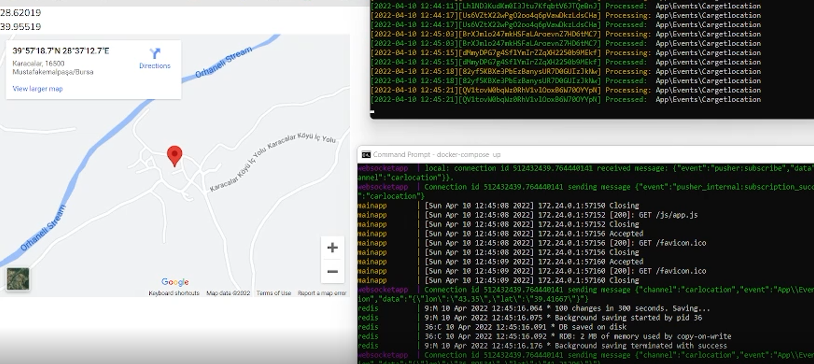

## Bitfinansal - Laravel Real-Time Location Tracking System

Kurulum:

- $ composer update
- $ docker-compose up -d
- $ php artisan php artisan queue:work // Data pushlamak icin
- Hepsi ayağa kalktıktan sonra database migrate için browser localip:8000/testdata 3 defa refresh yaptıktan sonra önce migrate ardından test datası ekleyip çalışmaya başlıyor.
- Browser'dan ana uygulama "local_ip:8000" giriliyor.

- Not:Data gelmemesi halinde "localip:8000/testdata" yeni data eklenebilir. Pushlanmaması halinde "localip:8000/location"

## Kullanılan Docker Imageleri

-  Laravel(Ana uygulama)
-  Laravel(Websocket)
-  Redis // localhost:8001 sayfasından görülebilir
-  Mysql

## Kullanılan Paketler

- Laravel/ui vue
- Laravel Echo
- Laravel Websocket //Pusher
- Predis
- Pusher Js

## Örnek Resim

Mertcan Yiğit

